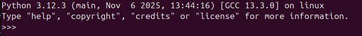
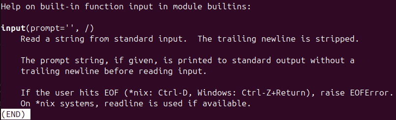
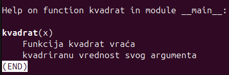

# Dokumentacioni stringovi, funkcije, mutabilni i imutabilni objekti

Podsećanja radi, funkcija u Pajtonu predstavlja **imenovani blok naredbi koji je indentiran na isti način**. Na primer, definisanje funkcije koja izračunava i vraća kvadrat svog argumenta može se implementrati na sledeći način:

    def kvadrat(n):
		#funkcija prima argument i vraća vrednost njegovog kvadrata
	    return n * n
Možemo videti da se unutar funkcije nalazi komentar koji objašnjava šta data funkcija radi. Međutim, ovaj komentar koristan je **samo onome ko je otvorio kod**. Sa druge strane, **višelinijski komentari predstavljaju dokumentacione stringove**. Kao što ime sugeriše, ovaj tip komentara pogodan je za pravljenje dokumentacije, pa se kao takav u praksi koristi prilikom pravljenja modula. Štaviše, to je **primarna namena**, dok je činjenica da se tako mogu pisati i komentari samo njena posledica.  Informacije zapisane unutar dokumentacionih stringova vidljive su **i u izvornom fajlu i u interpreteru**. 

Dokumentaciju o nekoj funkciji/tipu/klasi možemo dobiti pozivom `help(ime_fje/ime_klase/ime_tipa)` iz interpretera. Prvi korak jeste uključivanje samog interpretera, što se radi pozivom `python3` iz terminala (ili samo `python` ukoliko je verzija koja je instalirana na računaru manja od 3). Nakon uspešno izvršene komande, u terminalu bi trebalo da se vide najpre podaci o samom Pajtonu, a zatim, u novom redu oznaka `>>>` odakle se i zadaju komande za interpreter (slika ispod).

 Ukoliko želimo da vidimo informacije o funkciji `input`, to možemo uraditi na sledeći način:

    >>> help(input)
Kao rezultat, otvara se prozor sa dokumentacijom:

Izlaz iz dokumentacije ostvaruje se pritiskom na taster `q`, a iz interpretera naredbom `quit()`. Isti efekat možemo da postignemo i korišćenjem dokumentacionih stringova za korisnički definisane funkcije:

    def kvadrat(n):
	    """
	    Funkcija kvadrat vraća
	    kvadriranu vrednost svog argumenta
	    """
	    return n ** 2
	help(kvadrat)

Ponovo se otvara prozor sa dokumentacijom o traženoj funkciji:

## Funkcije
Pored već pomenutih ugrađenih funkcija i standardnih korisnički definisanih funkcija, Pajton nudi mogućnost definisanja nekih specifičnih funkcija.

### Prazna funkcija
Prazna funkcija je funkcija bez tela. Ona može imati proizvoljan broj argumenata ili ih ne mora imati uopšte. Međutim, bez obzira što nema telo, ona **mora imati bar 1 naredbu**. Prazna funkcija sa 3 argumenta definiše se na sledeći način:

    def prazna(x, y, z):
	    pass
	
Ključna reč `pass` koristi se da naznači da ne postoji povratna vrednost, tj. da je povratna vrednost prazna (null statement, `None`).
Prazna finkcija može biti od koristi kada:

 1. Znamo da treba implementirati određenu funkciju u okviru većeg projekta, ali još uvek nismo  stigli do njene implementacije (već je samo u planu).
 2. Ukoliko koristimo objektno-orijentisane koncepte u Pajtonu, onda bi se prazna funkcija koristila da implementira apstraktan metod neke apstraktne klase, dok bi onda njeno ponašanje bilo definisano u potklasama.
 3. Testiranje rada neke druge funkcije.

### Anonimna funkcija
Anonimna funkcija zadaje se u obliku izraza koji se dodeljuje nekoj promenljivoj. Naziv anonimna rezultat je činjenice da ovakve funkcije nemaju ime, već se izvršavaju jednom (onda kada su pozvane) i više se ne koriste kroz program. Kao i ostale funkcije, i anonimne mogu imati proizvoljan broj argumenata, ali ih i ne moraju imati. Telo anonimne funkcije može se zapisati u jednom redu. Takođe su poznate i pod imenom **lambda funkcije**. 

Anonimna funkcija koja prima dva argumenta i vraća vrednost njihovog zbira može se napisati na sledeći način:

    suma = lambda x, y: x + y
`Suma` je takozvani **funkcijski objekat**, ključna reč `lambda` označava da je u pitanju anonimna funkcija, `x` i `y` su njeni argumenti, `:` označava početak tela funkcije (kao i do sad). Izraz iza dvotačke izračunava se i predstavlja povratnu vrednost te funkcije. Anonimne funkcije pozivaju se kao i sve ostale funkcije:

    print(suma(1,2))
    print(suma("Neki", " tekst"))

Ukoliko želimo da vidimo kog je tipa neka funkcija, možemo to uraditi na sledeći način:

    print(suma)
    print(kvadrat)
Kao rezultat dobijamo: `<function <lambda> at 0x7aaa8e76f380>` i `<function kvadrat at 0x7aaa8e76fce0>`. U oba ispisa prva reč je `function` koja je indikator da se radi o funkciji, a poslednji deo ispisa označava njenu  **memorijsku lokaciju**. Jedino po čemu se ispisi razlikuju jeste naziv funkcije. Pošto je `kvadrat` definisan kao standardna korisnički definisana funkcija, njegov naziv je vidljiv i ispisuje se. Sa druge strane, pošto je lambda funkcija anonimna, tj. nema ime, kao indikator da se radi o anonimnoj funkciji ispisuje se `<lambda>`.

Definicija i poziv lambda funkcije bez argumenata se radi na sledeći način:

    ispis = lambda : print("Hello world")
    ispis()

 ### Funkcije sa promenljivim brojem argumenata
 Pored funkcija koje primaju fiksan broj argumenata, Pajton nam nudi i način da funkcijama prosleđujemo proizvoljan broj argumenata. Jedna od ovakvih funkcija je ugrađena funkcija `print`, pa možemo pogledati njen potpis (sa `help(print)`). Dobijamo sledeće informacije:
 `print(*args, sep=' ', end='\n', file=None, flush=False)`. Argumenti koje treba ispisati prosleđuju se kao prvi argument (preko `*args`). `Args` predstavlja **identifikator** (**n-torku**) i proizvoljne je dužine. `*` je operator koji govori interpreteru da treba da pokupi sve argumente koji slede neposredno za njom. Pored elemenata koje treba ispisati, `print` može primiti i neke **imenovane argumente** (argumente koji imaju svoje ime): `sep` koji označava koji karakter želimo da ispišemo kao separator između dva elementa prilikom ispisa (podrazumevano je razmak), `end` označava karakter koji želimo da ispišemo na kraju, kada smo završili sa ispisom elemenata (podrazumevano je novi red)...

**Napomena:** `args` je samo konvencionalan naziv za sve argumente, u praksi se može koristiti i bilo koji drugi naziv.

**Napomena 2:** n-torka je kolekcija elemenata proizvoljnog tipa. Slična je listama, samo se umesto uglastih (`[]`) koriste obične zagrade (`()`). 

Ukoliko želimo da napišemo našu funkciju `printf` koja će primati proizvoljan broj argumenata i sve ih ispisivati na standardni izlaz, to možemo uraditi na sledeći način:

    def printf(*args):
	    print(args)
	
	# primeri poziva
	printf(1, [1,2,3, "string"])
	printf()
	printf(1.4)

Funkcijama možemo proslediti i **proizvoljan broj imenovanih argumenata**. To radimo na sledeći način:

    def printf(**kwargs):
	    print(kwargs)
	
	# primeri poziva:
	printf(ime = "Pera", prezime = "Perić", godine = 25)
	printf(student = "Pera Perić", inddeks = "mi23018")
Slično prethodnom primeru, `kwargs` je identifikator (n-torka) koja hvata sve argumente koji se proslede, `*` je operator koji govori interpreteru da treba da pokupi sve argumente koji slede neposredno za njom, dok druga `*` označava da će argumenti biti imenovani, tj. da će argumenti biti prosleđeni u obliku mape (`ključ = vrednost`).

## Mutabilni i imutabilni objekti
U Pajtonu **je sve objekat**: i stringovi, i celi brojevi i realni brojevi i liste i torke i mape itd.
Svi objakti se dele na: 

 1. **mutabilne** :  **mape, liste i sve što je klasna instanca** (bilo da je instanca postojeće klase ili korisnički definisane) i 
 2. **imutabilne** : **brojevi** (celi i realni) **, torke i niske** (svaka izmena niske pravi novi objekat).

Za demonstraciju ćemo koristiti sledeće funkcije:
 

    x = 20

    def kvadrat(x):
	    print(x, id(x)) # funkcija id vraća adresu promenljive u memoriji
	    x = x ** 2
	    print(x, id(x))
	    return x
	
	# testiranje funkcije
	print(x, id(x))
	kvadrat(x)
	print(x, id(x))
    
  Kao rezultat dobijamo sledeći ispis:
   
	20 11756296
	20 11756296
	400 135698366742416
	20 11756296

Dakle, možemo videti da je u trenutku izračunavanja kvadrata argumenta došlo do pravljenja nove promenljive, a ne do promene vrednosti prosleđenog argumenta. Ovim je demonstrirana imutabilnost brojeva.

Sa druge strane, ako imamo funkciju koja treba da promeni listu:
 

    def izmeni_listu(l):
	    print(l, id(l))
	    l[0] = "0"
	    print(l, id(l))
	    
	# testiranje funkcije
	l = [1,2,3,4,5]
	print(l, id(l))
	izmeni_listu(l)
	print(l, id(l))

dobijamo sledeći ispis:

    [1, 2, 3, 4, 5] 124634424314688
	[1, 2, 3, 4, 5] 124634424314688
	['0', 2, 3, 4, 5] 124634424314688
	['0', 2, 3, 4, 5] 124634424314688
Vidimo da je lista izmenjena a da se njena adresa nije menjala tokom celog izvršavanja. Stoga možemo zaključiti da su liste mutabilne, tj. da izmenom argumenta funkcije menjamo upravo original. 

## Liste
Liste u Pajtonu su ugrađene strukture podataka koji predstavljaju kolekciju objekata **proizvoljnog tipa**. Tako se u jednoj listi mogu naći objekti različitog tipa:

    l = [1, 4.5, "tekst", [1,2,3,4]]
    print(l)
Podsećanja radi, liste su mutabilne, pa se njihov sadržaj može menjati za vreme izvršavanja programa. Neke od najkorisnijih funkcija za rad sa listama su:

 - `len` - vraća dužinu prosleđene liste
 - `+` - konkatenacija (nadovezivanje) listi
 - `append(element)` - dodaje `element` na kraj liste
 - `insert(indeks, element)` - dodaje `element` na poziciju na mestu `indeks` 
 - `remove(element)` - briše `element` iz liste ako postoji (inače ne menja listu)
 - `reverse()` - obrće listu
 - `lista[indeks]` - indeksni pristup, vraća vrednost elementa koji se nalazi na mestu `indeks` u listi
 - `sum(lista)` - vraća zbir elemenata liste (radi **samo ako su svi elementi brojevnog tipa**)
 - `lista[indeks1: indeks2]` - vraća listu elemenata koji se nalaze u intervalu [indeks1, indeks2) (**ne računajući indeks2**)
 - `lista[:indeks]` - vraća listu elemenata koji se nalaze u intervalu `[0, indeks)`
 - `lista[indeks:]` - vraća listu elemenata koji se nalaze u intervalu `[indeks, len(lista) - 1)`
 - `lista[:]` - vraća celu listu

**Napomena:** elementi liste indeksirani su od 0!
**Napomena2:** elementima listi u Pajtonu se može pristupiti i sa negativnim indeksima:
`lista[-1]` vraća poslednji element liste, `lista[-2]` pretposlednji i tako dalje.

> lista = [1, 2, 3, 4, 5 ]
> print(len(lista))
> lista.append(6) # lista = [1,2,3,4,5,6]
> lista.insert(6, 7) # lista = [1,2,3,4,5,6,7]
> lista += [8,9,10] # lista = [1,2,3,4,5,6,7,8,9, 10]
> lista.remove(10) # lista = [1,2,3,4,5,6,7,8,9]
> lista.reverse() # lista = [9,8,7,6,5,4,3,2,1]
> print(sum(lista)) # vraća zbir svih elemenata liste
> print(lista[3]) # vraća element koji se nalazi na indeksu 3

## For petlja
`For` petlja u Pajtonu koristi se za iteraciju kroz **kolekcije** (mape, liste, torke, skupove, i slično). Njena sintaksa se malo razlikuje od `for(inicijalizacija; uslov; korak)` sa kojom smo se susretali u ostalim programskim jezicima i sličnija je iteratorskim metodama koje se sreću u **objektno-orijentisanim jezicima**. U samom telu for petlje može se naći jedna ili više naredbi, a sve naredbe koje se nalaze u njenom telu indentovane su isto.
Sinteksa for petlje u Pajtonu je sledeća:

    for element in kolekcija:
	    # blok naredbi
Na primer, ukoliko želimo da ispišemo sve elemente koji se nalaze u nekoj listi, to možemo uraditi na sledeći način:

    fruits = ["apple", "banana", "cherry"]  
	for fruit in fruits:  
		print(fruits) # naredbe u petlji su indentovane

Sa druge strane, ukoliko želimo da postignemo da kroz petlju prođemo tačno određeni broj puta, to možemo uraditi tako što najpre napravimo kolekciju indeksa kroz koje želimo da prođemo, a zatim iteriramo kroz tu kolekciju na standardni način. Pravljenje liste indeksa omogućava nam funkcija `range()`. 

    indeksi1 = range(n) # lista elemenata [0, n)
    indeksi2 = range(a, b) # lista elemenata [a, b)
    
Primer upotrebe ovakve for petlje:

    for x in range(10):  
		print(x) # ispisuju se elementi [0, 9]
		
## Mape
Mape (**rečnici**) su strukture podataka koje se koriste da čuvaju podatke u parovima `ključ : vrednost`. Rečnici su mutabilni objekti: u toku izvršavanja programa, novi podaci se mogu dodati u mapu, stari se mogu brisati, a vrednosti koje su dodeljene nekom ključu se takođe mogu menjati vrementom. Međutim, iako je sama mapa mutabilan objekat, **ključ mape mora biti imutabilan**. Dakle, kao ključevi se mogu koristiti niske, brojevi, torke itd, dok vrednosti mogu biti bilo kog tipa. 

**Napomena:** U Pajtonu se mapa obeležava kao tip `dict` (skraćeno od dictionary).

Kreiranje prazne mape može se izvršiti na neki od sledeća 2 načina:

    mapa = dict() 
    mapa2 = {}

 Ukoliko želimo da napravimo mapu koja u sebi već sadrži neke vrednosti, to možemo uraditi:
 

    mapa = {
	    "ime" : "Pera",
		"prezime" : "Peric",
		"godine" : 23
    }
Dodavanje para vrednosti `ključ : vrednost` u mapu vrši se na sledeći način:

    mapa[novi_ključ] = nova_vrednost
 Na primer, 
 

    mapa["indeks"] = "mi23452"

Ukoliko ključ koji pokušavamo da dodamo već postoji, onda će vrednost koja mu odgovara biti ažurirana.

### Ispis elemenata mape
Elementi mape mogu se ispisati na više načina. Jedan od njih jeste korišćenjem funkcije `print`:

    print(mapa)
Primenom date funkcije, dobijamo sledeći ispis:

 `{'ime': 'Pera', 'prezime': 'Peric', 'godine': 23, 'indeks': 'mi23452'}`.

Ukoliko želimo da ispišemo svaki element u novom redu, možemo proći kroz sve elemente mape jednom petljom i ispisivati parove:

    for element in mapa: # iteracija kroz KLJUČEVE 
	    print(element, ":", mapa[element]) # mapa[element] vraća vrednost koja odgovara ključu element
Rezultat je sledeći ispis:

    ime : Pera
	prezime : Peric
	godine : 23
	indeks : mi23452
Još jedan način da se prođe kroz mapu obuhvata prolazak kroz kolekciju ključeva i vrednosti koju vraća `mapa.items()`:

    for ključ, vrednost in mapa.items():
	    print(ključ, ":", vrednost)

Lista ključeva koji se javljaju u mapi može se dobiti pozivom:

    print(list(mapa.keys())) # mapa.keys() vraća objekat tipa dict_keys
Kao rezultat dobija se: `['ime', 'prezime', 'godine', 'indeks']`.

Sličan postupak moguće je uraditi i za vrednosti, samo se umesto `mapa.keys()` poziva `mapa.values()`:

    print(list(mapa.values()))
   Rezultat ovog poziva je: `['Pera', 'Peric', 23, 'mi23452']`.
