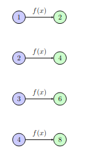
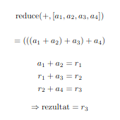
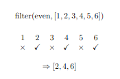

# List comprehension, funkcije višeg reda, rad sa fajlovima

## List comprehension
List comprehension je sažet i čitljiv način za pravljenje novih listi u Pajtonu. Omogućava da u jednoj liniji koda opišemo kako se elementi preuzimaju iz neke kolekcije, kako se po potrebi menjaju i pod kojim uslovima se uključuju u novu listu.

Osnovna ideja je da se klasična `for` petlja, u kojoj prolazimo kroz elemente i dodajemo ih u listu pomoću `append`, zameni kraćom i jasnijom sintaksom. Umesto više linija koda, logika pravljenja liste je objedinjena na jednom mestu, što olakšava razumevanje šta se tačno dešava. Njegova prednost u odnosu na ručno dodavanje u listu je u tome što je kod kraći, čitljiviji i često efikasniji jer Pajton može brže da obradi ovakav izraz nego eksplicitnu petlju sa dodavanjem elemenata jedan po jedan.

Sintaksa pravljenja liste koristeći list comprehension je sledeća:

    lista = [opis_elementa domen za jedan element]
Na primer, ukoliko želimo listu brojeva od 1 do n, poznato je da je domen upravo [1, n]. U Pajtonu, ovaj domen možemo dobiti pozivom `range(1, n + 1)`. Ostalo je još odrediti samo opis jednog elementa. Znamo da svaki element liste treba da uzme po jednu vrednost baš iz liste koju je funkcija `range` vratila, te stoga finalni izraz možemo napisati kao:

    lista = [x for x in range(1, n + 1)]
Sa druge strane, ako želimo listu parova (x, y) takvih da $x \in [a, b]$, a $y \in [c, d]$, to možemo uraditi na sledeći način:

    lista = [(x, y) for x in range(a, b + 1) for y in range(c, d + 1)]
Primetimo da između domena **ne postoje  zarezi, zagrade ili bilo kakvo razdvajanje elemenata**. 

**Napomena:** dati kod će raditi i u slučaju da su segmenti disjunktni, ali i kada je a > b ili c > d. U tom slučaju, biće vraćena prazna lista.

## Funkcija zip
Funkcija `zip` u Pajtonu služi za paralelno iteriranje kroz više kolekcija istovremeno. Ona spaja elemente iz dve ili više k u parove (ili torke - ako ima više od dve kolekcije), tako da se prvi elementi grupišu zajedno, zatim drugi, i tako redom. Na primer, ako imamo dve liste iste dužine, `zip` će povezati njihove odgovarajuće elemente u jednu novu strukturu. Povratna vrednost ove funkcije je **zip objekat**, pa je potrebno najpre ga **kastovati u listu** da bi sa njim moglo dalje da se radi. Tako će se prilikom pokretanja koda:

    l1 = [1,2,3,4,5]
    l2 = [6,7,8,9,10]

    zipovano = zip(l1, l2)
    print(list(zipovano)) # zip objekat se kastuje u listu pre ispisa
dobija se sledeći rezultat:

    [(1, 6), (2, 7), (3, 8), (4, 9), (5, 10)]

Funkcija `zip` će neometano raditi i u slučaju kada kolekcije koje su joj prosleđene nisu iste dužine. U tom slučaju, funkcija će spajati elemente sve dok ne dođe do **kraja kraće kolekcije**, pa tako kod:

    l1 = [1,2,3,4,5]
    l2 = [6,7,8]

    zipovano = zip(l1, l2)
    print(list(zipovano)) # zip objekat se kastuje u listu pre ispisa
ispisuje sledeće:

    [(1, 6), (2, 7), (3, 8)]

`zip` se najčešće koristi u `for` petljama, ali i u kombinaciji sa list comprehension-om, kada želimo da elegantno obradimo povezane podatke. Prednost `zip` funkcije je u tome što čini kod čitljivijim i jasnijim, jer eliminiše potrebu za ručnim indeksiranjem i pristupanjem elementima preko indeksa. Takođe, `zip` ne pravi odmah celu listu u memoriji, već vraća iterator, što ga čini efikasnim za rad sa većim skupovima podataka.

## Funkcije višeg reda
**Funkcijama višeg reda** nazivaju se funkcije koje kao neki od svojih argumenata mogu primiti funkcije, ili pak vratiti neku drugu funkciju kao svoj rezultat. Funkcijski objekti se **ne prevode u trenutku svoje definicije**, već samo onda kada su pozvani. 

### Map
Funkcija `map` u Pajtonu služi za primenu iste funkcije na svaki element neke kolekcije (ili više kolekcija) i vraća rezultat kao niz novih vrednosti. Umesto da eksplicitno prolazimo kroz elemente pomoću `for` petlje, `map` omogućava da jasno izrazimo **šta** želimo da uradimo sa svakim elementom, a ne **kako** da kroz njih prolazimo. Primer primene funkcije f(x) = 2x na listu elemenata može se videti na slici ispod.

Osnovna sintaksa funkcije `map` je

 `map(funkcija, kolekcija)`. Na primer, ako želimo da svaki broj u listi uvećamo za 1, možemo napisati funkciju `inkrementiraj(x)` koja će uvećati prosleđeni argument za 1:

    def inkrementiraj(x):
	    return x += 1

 Sada možemo datu funkciju proslediti funkciji `map` na sledeći način: `map(inkrementiraj, [1,2,3])`. `Map` će tada primeniti funkciju inkrementiraj na svaki element kolekcije pojedinačno, pa će krajnji rezultat biti `[2,3,4]`.  Međutim, kao i kod `zip` funkcije, rezultat `map` funkcije nije odmah lista, već iterator (u ovom slučaju **map objekat**), pa ga je potrebno kastovati u listu ako želimo da vidimo ili dalje koristimo rezultate.

Primetimo i da će u ovom slučaju funkcija `inkrementiraj` biti korišćena **samo jednom** i to prilikom mapiranja. Stoga nema razloga da pravimo imenovanu funkciju, već isti efekat možemo postići korišćenjem `lambda` funkcije. U tom slučaju, poziv bi izgledao ovako:

    map(lambda x: x + 1, [1,2,3])
**Napomena:** `map` se koristi kada je potrebno **transformisati elemente**. Transformacija elemenata je proizvoljna. 

**Napomena 2:** `map` kao argument prima **isključivo unarnu funkciju** (funkciju jednog argumenta).

### Reduce
Funkcija `reduce` iz modula `functools` služi za **akumulaciju elemenata liste (ili druge kolekcije) u jednu vrednost** tako što primenjuje funkciju par po par na elemente kolekcije. Za razliku od `map`, koja transformiše svaki element u novu listu, `reduce` postepeno "redukuje" listu na jedan rezultat. Najpre se funkcija primeni na prva dva elementa liste i tako se dobije međurezultat. Zatim se funkcija primenjuje na dobijeni međurezultat i sledeći element liste, čime se dobija novi međurezultat. Isti postupak se ponavlja dok se ne dođe do kraja kolekcije. Poslednji rezultat je povratna vrednost ove funkcije. Ilustrovana primena funkcije nalazi se na slici ispod:

Osnovna sintaksa je:

    from functools import reduce
	reduce(funkcija, kolekcija[, inicijalna_vrednost])
gde:

	 -   `funkcija` prima dva argumenta i vraća jedan rezultat (funkcija je **binarna**).
    -   `kolekcija` je kolekcija kroz koju je moguće itarirati
    -   `inicijalna_vrednost` je opcionalna vrednost koja se koristi kao prvi argument pri prvom pozivu funkcije (korisno kada se prosledi nevalidan argumment).

Na primer, ako želimo da saberemo sve brojeve u listi, to možemo uraditi na sledeći način:

    from functools import reduce
    
    brojevi = [1, 2, 3, 4]
    zbir = reduce(lambda x, y: x + y, brojevi)	
    print(zbir)  # 10

Primetimo da za razliku od funkcija `zip` i `map`, `reduce` vraća konkretnu vrednost.

Funkcija `reduce` je naročito korisna kada želimo da **agregiramo podatke** – npr. sabiranje, množenje, konkatenacija stringova ili računanje maksimuma/minimuma. Njena prednost je što elegantno uklanja potrebu za eksplicitnom `for` petljom i privremenim promenljivama, ali može biti manje čitljiva ako se koristi za komplikovane funkcije.

### Filter
Funkcija `filter`, kao što joj ime kaže, služi za **filtriranje elemenata iz kolekcije** prema nekom uslovu. Umesto da prolazimo kroz listu i ručno dodajemo elemente koji zadovoljavaju uslov u novu listu, `filter` omogućava elegantno i čitljivo izdvajanje samo onih elemenata koji zadovoljavaju funkciju koja vraća `True` ili `False`. Osnovna sintaksa je:
`filter(funkcija, kolekcija)`, gde 

-   `funkcija` prima jedan argument i vraća `True` ili `False` (**buleanska unarna funkcija**), a 
-   `kolekcija` je iterabilna

 Rezultat `filter` funkcije je iterator (**filter objekat**), pa ga je potrebno pretvoriti u listu ako ima dalju primenu u kodu.

Na primer, ukoliko želimo da izdvojimo sve parne brojeve iz liste, to možemo uraditi na sledeći način:

    brojevi = [1, 2, 3, 4, 5, 6]
    parni = list(filter(lambda x: x % 2 == 0, brojevi))
    print(parni)  # rezultat je [2, 4, 6]
Vizuelni prikaz gore opisanog rešenja može se videti na slici ispod:

Funkcija `filter` je naročito korisna kada želimo da **izdvojimo samo elemente koji zadovoljavaju određeni kriterijum**, a da pri tom ne menjamo samu kolekciju. Njena prednost je u čitljivosti i sažetosti koda, posebno u kombinaciji sa `lambda` izrazima ili list comprehension-om.

## Rad sa fajlovima
Rad sa fajlovima u Pajtonu je veoma važan deo programiranja jer omogućava trajno čuvanje i kasnije korišćenje podataka. Kada govorimo o **tekstualnim fajlovima**, Pajton nudi jednostavan i čitljiv način za njihovo otvaranje, čitanje i pisanje. Osnovna funkcija za rad sa fajlovima je `open(putanja_do_fajla, režim_rada)`. Prilikom prosleđivanja putanje do fajla mogu se koristtiti **apsolutna i relativna putanja**. Apsolutna putanja daje punu adresu fajla, počev od korenog direktorijuma, dok se relativna putanja zadaje u odnosu na **trenutni radni direktorijum** (direktorijum u kome se nalazimo kada želimo da pristupimo fajlu). Što se tiče režima,  najčešće se koriste `"r"` (za čitanje), `"w"` (za pisanje, pri čemu se stari sadržaj briše) i `"a"` (za dodavanje novog sadržaja na kraj fajla). 

Treba napomenuti da u slučaju da u slučaju korišćenja `"a/r"` režima fajl sa naznačenim imenom **mora postojati**. Kada je reč o režimu `"w"`, fajl sa datim imenom može a i ne mora postojati. Ukoliko fajl već postoji, njegov sadržaj se briše i u fajl se upisuje nov sadržaj. Sa druge strane, fajl sa datim imenom se automatski kreira i u njega se upisuje naznačeni sadržaj. Ako je potrebno istovremeno omogućiti i čitanje iz fajla i pisanje u njega mogu se koristiti režimi `"r+"` i `"a+"`.

**Napomena:** da bi se fajl otvorio u `"r+"` režimu on mora prethodno postojati, a postojeći sadržaj se **ne briše** automatski. Nasuprot tome, prilikom otvaranja u `"a+"` režimu fajl ne mora prethodno postojati. Ako postoji, sav njegov sadržaj se **briše**.

Nakon otvaranja fajla, nad njim se mogu koristiti različite metode. Za čitanje tekstualnih fajlova često se koriste metode `read()`, koja čita ceo sadržaj fajla kao jedan string, `readline()`, koja čita jednu liniju, ili `readlines()`, koja vraća listu svih linija u fajlu. S druge strane, za upis teksta koristi se metoda `write()`, kojom se string zapisuje u fajl. Važno je voditi računa o prelazima u novi red (`\n`), jer se oni ne dodaju automatski.

Na kraju rada sa fajlom, potrebno ga je zatvoriti pomoću metode `close()`, kako bi se oslobodili resursi sistema:

    # pišemo u fajl
    f = open("proba.txt", "w")
    f.write("\nNeki tekst")
    f.close()

	# čitamo sadržaj iz fajla
    f = open("proba.txt", "r")
    sadrzaj = f.read()
    print(sadrzaj)
    f.close()

Međutim, u praksi se češće koristi `with open` konstrukcija (tzv. **context manager**), koja automatski zatvara fajl nakon završetka bloka koda. Ovaj pristup je sigurniji i čitljiviji, posebno kada se radi sa većim brojem fajlova ili složenijim operacijama nad tekstualnim podacima:

    with open("proba.txt", "r") as f: # otvaramo fajl i nazivamo ga f
		sadrzaj = f.readlines()
		print(sadrzaj)

Prilikom rada sa fajlovima može doći do različitih grešaka, najčešće u situacijama kada fajl ne postoji, kada nemamo odgovarajuće dozvole ili je putanja do fajla pogrešna. U takvim slučajevima Pajton baca izuzetke (_exceptions_), a najčešći su `FileNotFoundError` i `IOError`.

Na primer, ako pokušamo da otvorimo fajl u režimu `"r"` ili `"r+"`, a fajl ne postoji, program će se prekinuti sa greškom `FileNotFoundError`. Slično tome, greška može nastati i ako pokušamo da otvorimo fajl u režimu `"w"` ili `"w+"`, ali nemamo dozvolu za pisanje na toj lokaciji. Ovi problemi se mogu preduprediti korišćenjem `try-except` bloka:

    try:
	    with open("proba.txt", "w") as f:
		    f.write("Nov sadržaj fajla!\n")
	except IOError:
		print("Došlo je do greške prilikom otvaranja fajla!")
		exit(1)
## JSON format
**JSON (JavaScript Object Notation)** je lagan i čitljiv format za razmenu i čuvanje podataka, veoma često korišćen u konfiguracionim fajlovima i komunikaciji sa veb servisima. Struktura JSON-a se zasniva na parovima **ključ:vrednost**, listama i ugnježdenim objektima, što ga čini prirodnim za mapiranje na Pajtonove tipove podataka kao što su rečnici (`dict`) i liste (`list`).

U Pajtonu se za rad sa JSON fajlovima koristi standardni modul `json`. Čitanje JSON fajla se najčešće obavlja pomoću funkcije `json.load(pokazivač_na_fajl)` koja sadržaj fajla pretvara u odgovarajuću Pajton strukturu podataka. Na primer, JSON objekat postaje rečnik, dok JSON niz postaje lista. Ovo omogućava jednostavan pristup podacima korišćenjem ključeva i indeksa, kao i dalju obradu podataka u programu. Ako se JSON objekat učitava sa standardnog ulaza koristi se funkcija `josn.loads`.

Pisanje podataka u JSON fajl vrši se pomoću funkcije `json.dump(pajton_objekat, putanja_do_fajla)`. Pored toga, JSON format zahteva da je podatke moguće serijalizovati, što znači da moraju biti osnovni tipovi (brojevi, stringovi, liste, rečnici, `true/false` i `null`). Složeniji objekti moraju se prethodno prilagoditi ili konvertovati. Za ispis JSON objekta na standardni izlaz koristi funkcija `json.dumps(objekat)`.

Na kraju, važno je napomenuti da JSON fajlovi, iako su tekstualni, imaju stroga pravila sintakse. Greške poput zareza viška, pogrešnih navodnika ili neispravno zatvorenih zagrada dovode do `JSONDecodeError` prilikom čitanja. Zbog toga se i rad sa JSON fajlovima često kombinuje sa `try` / `except` blokovima, kako bi se greške u formatu ili pristupu fajlu obradile na bezbedan i kontrolisan način.

Ispod je dat način učitavanja sadržaja iz više različitih JSON fajlova:

    import json
	
	try:
    with open("korpa.json", "r") as f:
        korpa = json.load(f)
    with open("maxi_cene.json", "r") as f:
        maxi_cene = json.load(f)
    with open("idea_cene.json", "r") as f:
        idea_cene = json.load(f)
    with open("shopngo_cene.json", "r") as f:
        shopngo_cene = json.load(f)
    except IOError:
	    print("Greska prilikom otvaranja fajlova")
	    exit(1)

Sledeći primer ilustruje razlike prilikom čuvanja JSON niza i JSON objekta unutar fajla. Primer čuvanja JSON niza:

    [ {"ime" :"jabuke", "cena" : 39.9},
	  {"ime" :"kruske", "cena" : 100},
	  {"ime" :"grozdje", "cena" : 90},
	  {"ime" :"breskve", "cena" : 59.9} ]
Primer čuvanja JSON objekta:

    {"ime": "Pera",
	  "prezime": "Perić",
	  "godine": 23,
	  "zaposlen": false,
	  "vestine": ["Python", "Haskell", "Prolog"]
	}

Iz datih primera vidi se da se JSON niz može prirodno predstaviti uz pomoć **Pajton liste**. Stoga nad njim možemo primeniti sve funkcije koje možemo priimeniti i nad listama. Samo treba obratiti pažnju da je to lista mapa. Sa druge strane, JSON objekat se u Pajtonu može intuitivno predstaviti **mapom**, te se učitani objekat može koristiti kao bilo koja Pajton mapa. 
