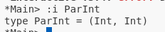
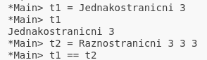

# Tipovi

Do sada smo videli kako se radi sa ugrađenim tipovima podataka  (`Int, Double, par, torka, lista, String, Char...`). Međutim, Haskel omogućava i rad sa korisni;ki definisanim tipovima. Prilikom rada sa novim tipovima Haskel razlikuje termine <b>definicije</b> i <b>deklaracije</b> tipa.

## Deklaracija
Pod <b>deklaracijom</b> tipa podrazumeva se pravljenje alijasa za već postojeći tip. Sintaksa koja se koristi za deklarisanje tipa izgelda ovako:
`type ime_tipa [parametri] = tip_za_koji_pravimo_alijas`, gde su parametri opcioni, tj. mogu se naći u deklaraciji, ali i ne moraju. U nastavku ćemo videti kada ih je neophodno navoditi, a kada se ne navode. 

Ukoliko bismo želeli da napravimo svoj tip `ParInt` koji će biti alijas za par celobrojnih vrednosti, to radimo na sledeći način:
`type ParInt = (Int, Int)`. Podsećanja radi, <b>imena tipova i tipskih razreda obavezno moraju početi velikim slovom!</b> Dalje možemo koristiti deklarisani tip kao što bismo koristili i običan par. Na primer, neka je potrebno definisati funkciju koja prima par celobrojnih vrednosti i vraća proizvod njegovih elemenata. 

Najpre je potrebno odrediti potpis funkcije. Nakon što je alijas uveden, on se nalazi u dokumentaciji (vidi sliku ispod) i može se nesmetano koristiti. Dakle, potpis je sledeći: 
`proizvod :: ParInt -> Int`. Definicija je jednostavna, kao i prilikom rada sa parovima:
`proizvod (a, b) = a * b`. 

Primetimo da prilikom deklaracije tipa nismo koristili nikakav parametar. To je zato što smo pravili alijas koji menja <b>tačno određeni tip podataka.</b> Što znači, ukoliko bismo želeli da napravimo par vrednosti istog tipa, ali bez ograničenja po pitanju tipa (moguće je napraviti par celobrojnih vrednosti, par realnih vrednosti, par listi i slično) korišćenje parametara bilo bi obavezno. Neka se ovaj tip zove `Par`. Njegova deklaracija izgledala bi ovako: 
`type Par a = (a, a)`.  I ovako deklarisan tip možemo koristiti dalje u funkcijama, s tim što je u svakom potpisu funkcije pored tipa <b>neophodno navesti i tip parametra koji će biti prosleđen!</b> Ukoliko bismo opet želeli da definišemo `proizvod`, ali sada za tip `Par`, to bi se moglo učiniti na sledeći način:
`proizvod' :: Par Int -> Int`. Definicija funkcije se ne bi promenila:
`proizvod' (a, b) = a * b`

<b>Napomena: svi</b> tipski parametri koji se nalaze sa desne strane <b>moraju</b> se naći i sa leve. Ukoliko bismo na primer želeli da dopustimo da elementi tipa `Par` budu proizvoljni (ne moraju biti istog tipa), onda bi odgovarajuća deklaracija glasila:
`type Par a b = (a, b)`, pri čemu `a` i `b` mogu biti isti tipovi, a i ne moraju. Ponovo, prilikom deklaracije funkcije koja prima `Par` kao svoj argument neophodno je navesti sve tipove argumenata. Ponovo ćemo za primer uzeti  pomenutu funkciju `proizvod`:
`proizvod :: Par Int Float -> Float`
`proizvod (a, b) = (fromIntegral a) * b`. Podsetimo se, da bismo mogli da množimo vrednosti tipa `Int` sa vrednostima tipa `Float`, moramo najpre eksplicitno konvertovati `Int` u `Float` kao posledica <b>stroge tipiziranosti programskog jezika Haskel</b>.

## Definicija
Za razliku od deklaracije, <b>definisanje</b> tipa zaista pravi novi tip koji ne postoji. Nov tip se može definisati sledećom sintaksom:

`data ime_tipa [param] = konstruktor1 [param1] | konstruktor2 [param2] | ... | konstruktorn [paramn]`, pri čemu konstruktori ne moraju imati parametre, ali ako ih imaju ne mora svaki konstruktor imati isti broj parametara. Takođe, kao i tipovi i tipski razredi, i imena konstruktora moraju počinjati velikim slovom i ne smeju biti isti kao neka ključna reč u Haskelu. Svi tipovi u Haskelu definisani su upravo korišćenjem ove sintakse: 
 

Ukoliko bismo želeli da sami definišemo naš bulovski tip, to bismo mogli da uradimo na sledeći način: 
`data BulovskiTip = Tacno | Netacno`.  Sada se nesmetano mogu praviti instance datog tipa.  Ovo je bio primer kada tip i njegovi konstruktori nemaju parametre.

Sa druge strane, ukoliko bismo želeli da napravimo nov tip podataka `Trougao`, koji će omogućavati pravljenje jednakostraničnog, jednakokrakog i raznostraničnog trougla bez pretpostavki o tome kog će tipa biti veličine njegovih stranica, to ne možemo uraditi bez parametara. Primetimo takođe da nam je za pravljenje jednakostraničnog trougla dovoljna informacija o jednoj stranici, za jednakokraki trougao potrebne su nam dve stranice, a za raznostranični sve tri, što znači da će se i broj parametara svakog konstruktora razlikovati. Najzad, odgovarajuća definicija tipa je:
`data Trougao a b c = Jednakostranicni a`
			&nbsp; &nbsp;&nbsp;&nbsp;&nbsp;&nbsp;&nbsp;&nbsp;&nbsp;&nbsp;&nbsp;&nbsp;&nbsp;&nbsp;&nbsp;&nbsp;&nbsp;&nbsp;&nbsp;&nbsp;&nbsp;&nbsp;&nbsp;&nbsp;&nbsp;&nbsp;&nbsp;&nbsp;&nbsp;&nbsp;&nbsp;&nbsp;&nbsp;&nbsp;&nbsp;	`| Jednakokraki a b`
              &nbsp;&nbsp;&nbsp;&nbsp;&nbsp;&nbsp;&nbsp;&nbsp;&nbsp;&nbsp;&nbsp;&nbsp;&nbsp;&nbsp;&nbsp;&nbsp;&nbsp;&nbsp;&nbsp;&nbsp;&nbsp;&nbsp;&nbsp;&nbsp;&nbsp;&nbsp;&nbsp;&nbsp;&nbsp;&nbsp;&nbsp;&nbsp;&nbsp;&nbsp;&nbsp;&nbsp;  `| Raznostranicni a b c`.  Ponovo, svi parametri koji se nalaze na desnoj strani, moraju se naći i na levoj.

Definišimo sada funkciju koja će računati obim trougla. Pošto  `Trougao` ima svoje parametre, opet je neophodno navesti koji je tip parametara u pitanju prilikom definisanja funkcije koja će koristiti dati `Trougao`. Neka su stranice tipa `Float`. Tada potpis funkcije `obim` izgleda ovako:
`obim :: Trougao Float Float Float -> Float`. Primetiti da su <b>tipovi parametara razdvojeni belinama.</b> Sada je još potrebno definisati kako se računa obim za tip `Trougao`. Pošto imamo različite vrste trouglova, potrebno je za svaku od njih ponaosob definisati način na koji se računa obim za nju. 

Opšta sintaksa za definisanje funkcija nad korisnički definisanim tipovima podataka je sledeća:

`ime_funkcije (konstruktor1 params1) = rezultat1`
`ime_funkcije (konstruktor2 params2) = rezultat2`
`...`
`ime_funkcije (konstruktorn paramsn) = rezultatn`.  Primenimo dati šablon na naš tip `Trougao` i našu funkciju `obim`:
`obim (Jednakostranicni a) = 3 * a`
`obim (Jednakokraki a b) = a + 2 * b`
`obim (Raznostranicni a b c) = a + b + c`.  

### Rad sa korisnički definisanim tipovima

Prilikom rada sa novodefinisanim tipovima podataka treba obratiti pažnju na jednu bitnu manu -- ne postoji podrška za rad sa tim tipovim osim onog što mi definišemo. Zaista, ako bismo napravili jednu instancu jednakostraničnog trougla i pokušali da je ispišemo videli bismo da će nam interpreter vratiti sledeću grešku:

 Greška se sastoji u tome što naš tip `Trougao` ne instancira tipski razred `Show` (tipski razred `Show` definiše kako se ispisuju svi ugrađeni tipovi podataka). Kako bi se premostio ovaj problem potrebno je (prilikom definisanja novog tipa) eksplicitno staviti do znanja interpreteru da je potrebno naš tip dodati u tipski razred `Show` kako bismo bili u mogućnosti da ga ispišemo. To se radi uz pomoć ključnih reči `deriving Show`. Dakle, odgovarajuća definicija tipa `Trougao` koja omogućava ispis instance datog tipa je:
`data Trougao a b c = Jednakostranicni a`
			&nbsp; &nbsp;&nbsp;&nbsp;&nbsp;&nbsp;&nbsp;&nbsp;&nbsp;&nbsp;&nbsp;&nbsp;&nbsp;&nbsp;&nbsp;&nbsp;&nbsp;&nbsp;&nbsp;&nbsp;&nbsp;&nbsp;&nbsp;&nbsp;&nbsp;&nbsp;&nbsp;&nbsp;&nbsp;&nbsp;&nbsp;&nbsp;&nbsp;&nbsp;&nbsp;	`| Jednakokraki a b`
              &nbsp;&nbsp;&nbsp;&nbsp;&nbsp;&nbsp;&nbsp;&nbsp;&nbsp;&nbsp;&nbsp;&nbsp;&nbsp;&nbsp;&nbsp;&nbsp;&nbsp;&nbsp;&nbsp;&nbsp;&nbsp;&nbsp;&nbsp;&nbsp;&nbsp;&nbsp;&nbsp;&nbsp;&nbsp;&nbsp;&nbsp;&nbsp;&nbsp;&nbsp;&nbsp;&nbsp;  `| Raznostranicni a b c deriving Show`. Ukoliko bismo sad pokušali da ispišemo pomenuti trougao, ne bismo imali problema.

Međutim, postavlja se pitanje <b>zašto je ispis baš ovakav kakav jeste?</b> 
Odgovor na ovo pitanje vrlo je prost. Pomenuli smo da tipski razred `Show` definiše kako se ispisuju ugrađeni tipovi podataka. Primetimo sada da se svaki konstruktor našeg tipa `Trougao` zaista sastoji od ugrađenih tipova podataka: sam naziv konstruktora je `String`, pa se on tako i ispisuje. Tip podataka koji je prosleđen kao stranica može biti `Int/Float/Double`, ali svi su oni ugrađeni i `Show` već zna njihov ispis, te dodaje i njega.

Naravno, ukoliko želimo i da poredimo trouglove na jednakost moguće je i to uraditi tako što naš tip `Trougao` ubacimo u tipski razred `Eq`. Ukoliko bismo želeli da pravimo poredak trouglova, mogli bismo ubaciti naš `Trougao` u tipski razred `Ord`. Tako bismo mogli da ubacimo naš tip u bilo koji od postojećih razreda. Međutim, ukoliko se naš tip ubacuje u više od jednog razreda, potrebno je listu svih razreda navesti u zagradama. Na primer, ukoliko bismo želeli da naš `Trougao` ubacimo u tipske razrede `Show, Eq i Ord`, to bismo uradili na sledeći način:
`data Trougao a b c = Jednakostranicni a`
			&nbsp; &nbsp;&nbsp;&nbsp;&nbsp;&nbsp;&nbsp;&nbsp;&nbsp;&nbsp;&nbsp;&nbsp;&nbsp;&nbsp;&nbsp;&nbsp;&nbsp;&nbsp;&nbsp;&nbsp;&nbsp;&nbsp;&nbsp;&nbsp;&nbsp;&nbsp;&nbsp;&nbsp;&nbsp;&nbsp;&nbsp;&nbsp;&nbsp;&nbsp;&nbsp;	`| Jednakokraki a b`
              &nbsp;&nbsp;&nbsp;&nbsp;&nbsp;&nbsp;&nbsp;&nbsp;&nbsp;&nbsp;&nbsp;&nbsp;&nbsp;&nbsp;&nbsp;&nbsp;&nbsp;&nbsp;&nbsp;&nbsp;&nbsp;&nbsp;&nbsp;&nbsp;&nbsp;&nbsp;&nbsp;&nbsp;&nbsp;&nbsp;&nbsp;&nbsp;&nbsp;&nbsp;&nbsp;&nbsp;  `| Raznostranicni a b c deriving (Show, Eq, Ord)`.

### Mane korišćenja ugrađenih funkcija nad novim tipom  

Iako je sada sve naizgled u redu, ipak treba imati na umu da smo definisali novi tip podataka i da uvek treba prvo ispitati kako će se ugrađene funkcije ponašati sa do sada nepoznatim konstruktorima. Na primer, jednakostranični trougao stranice 3 i raznostranični trougao sa stranicama 3, 3, 3 su, u stvari, jedan te isti trougao. No, ukoliko napravimo takva dva trougla u Haskelu i pitamo da li su jednaki, odgovor će biti -- ne! 

 Sada se, logično, nameće pitanje zašto je to tako.

 Odgovor leži u činjenici da nov tip može imati više različitih konstruktora, a pošto nijedan od njih nije ugrađen, jezik ne zna kako da ih međusobno poredi. Poređenje instanci koje su napravljene istim konstruktorom vrši se tako što se redom porede vrednosti argumenata koje su prosleđene konstruktoru. Ukoliko su prvi argumenti jednaki, prelazi se na drugi, pa ako su i oni jednaki na treći i tako dalje. Na osnovu vrednosti argumenata određuje se da li je prva instanca veća, jednaka ili manja od druge. No, primetimo da <b>ni ovakvo poređenje ne daje uvek dobar rezultat</b> (uzmimo za primer pravougaonik sa stranicama 3 i 4 i drugi pravougaonik sa stranicama 4 i 3. Naravno, ovo je jedan isti pravougaonik, ali će program, poredeći redom argumente konstruktora, zaključiti da je prvi pravougaonik manji od drugog).
Sa druge strane, ukoliko poredimo različite instance dobijene različitim konstruktorima, <b>uvek je manja ona instanca čiji je konstruktor prilikom definicije tipa naveden ranije.</b>

Kako bi se izbegli ovi problemi, Haskel daje opciju <b>predefinisanja funkcija.</b>

### Konstruktor sa imenovanim parametrima

Pre nego što se dotaknemo predefinisanja funkcija, potrebno je napomenuti da postoji još jedan način da se definiše nov tip podataka -- korišćenjem imenovanih parametara. Sintaksa ovakve definicije je:
`data ime_tipa = ime_konstruktora {`
&nbsp;&nbsp;&nbsp;&nbsp;&nbsp;&nbsp;&nbsp;&nbsp;&nbsp;&nbsp;&nbsp;&nbsp;&nbsp;&nbsp;&nbsp;&nbsp;&nbsp;&nbsp;`ime_param1 :: tip1,`
&nbsp;&nbsp;&nbsp;&nbsp;&nbsp;&nbsp;&nbsp;&nbsp;&nbsp;&nbsp;&nbsp;&nbsp;&nbsp;&nbsp;&nbsp;&nbsp;&nbsp;&nbsp;`ime_param2 :: tip2`,
&nbsp;&nbsp;&nbsp;&nbsp;&nbsp;&nbsp;&nbsp;&nbsp;&nbsp;&nbsp;&nbsp;&nbsp;&nbsp;&nbsp;&nbsp;&nbsp;&nbsp;&nbsp;`...`
&nbsp;&nbsp;&nbsp;&nbsp;&nbsp;&nbsp;&nbsp;&nbsp;&nbsp;&nbsp;&nbsp;&nbsp;&nbsp;&nbsp;&nbsp;&nbsp;&nbsp;&nbsp;`ime_paramn :: tipn`
`}`.  Pritom, ime tipa i ime konstruktora se mogu razlikovati, ali i ne moraju. Ukoliko bismo želeli da definišemo naš tip `Trougao` korišćenjem imenovanih parametara, to bismo uradili na sledeći način:
`data Trougao = MojTrougao {`
&nbsp;&nbsp;&nbsp;&nbsp;&nbsp;&nbsp;&nbsp;&nbsp;&nbsp;&nbsp;&nbsp;&nbsp;&nbsp;&nbsp;&nbsp;&nbsp;&nbsp;&nbsp;`a :: Float,`
&nbsp;&nbsp;&nbsp;&nbsp;&nbsp;&nbsp;&nbsp;&nbsp;&nbsp;&nbsp;&nbsp;&nbsp;&nbsp;&nbsp;&nbsp;&nbsp;&nbsp;&nbsp;`b :: Float`,
&nbsp;&nbsp;&nbsp;&nbsp;&nbsp;&nbsp;&nbsp;&nbsp;&nbsp;&nbsp;&nbsp;&nbsp;&nbsp;&nbsp;&nbsp;&nbsp;&nbsp;&nbsp;`c :: Float`
`}`.

### Predefinisanje funkcija

Ukoliko želimo da predefinišemo neku funkciju za naš tip tako da radi kako mi želimo, to možemo uraditi korišćenjem sledeće sintakse:
`instance tipski_razred_iz_kog_predefinišemo_funkciju tip_koji_je_predefiniše where ime_funkcije_koja_se_predefiniše konstruktor = rezultat`. Na primer, ukoliko bismo želeli da trougao ispišemo kao uređenu trojku brojeva, to možemo uraditi na sledeći način: najpre je potrebno odrediti koju funkciju predefinišemo -- to je u našem slučaju `show`. Kom tipskom razredu ona pripada -- pripada razredu `Show`. Koji tip je predefiniše -- pa naš `Trougao` (definisan uz pomoć imenovanih parametara). Dakle, krajnji rezultat je:

`instance Show Trougao where show (Trougao a b c) = `
`"(" ++ show a ++ ", " ++ show b ++ ", " ++ show c ++ ")"`. 
Na isti način bismo mogli da predefinišemo recimo funkciju koja proverava da li su 2 trougla jednaka (jer znamo da će ih porediti po parovima, pa će trougao sa stranicama 3, 4 i 5 i trougao sa stranicama 5, 4 i 3 biti označeni kao različiti):
`instance Eq Trougao where`
    &nbsp;&nbsp;&nbsp;&nbsp;&nbsp;&nbsp;&nbsp;&nbsp; `(==) (Trougao a1 b1 c1) (Trougao a2 b2 c2) = ((sort [a1, b1, c1]) == (sort [a2, b2, c2]))`. Na isti način bismo mogli da predefinišemo funkcije `>` i `<` iz razreda `Ord`.

### Definisanje rekurzivnih tipova podataka

Haskel takođe nudi podršku za definisanje rekurzivanih tipova podataka. Opšti šablon za definisanje ovakvih tipova je:
`data ime_rekurzivnog_tipa [parametri] = konstruktor_za_bazni_slučaj | konstruktor_jednog_elementa [parametri] (ime_rekurzivnog_tipa [parametri])`.

Na primer, ukoliko bismo želeli da definišemo tip `Lista`, to bismo mogli da uradimo na sledeći način:
`data Lista a = Null | Konstanta a (Lista a) deriving Show`.