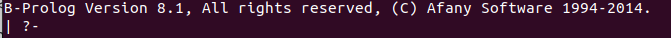

# Uvod u Prolog

Programski jezik Prolog je jedan od najpoznatijih predstavnika <b>logičke paradigme</b> (ostali poznati predstavnici su ASP i Datalog). Naziv samog jezika nastalo je kao skraćenica od "PROgramming in LOGic" i zasnovan je na <b>logici prvog reda</b>. 

Postoje razne distribucije programskog jezika Prolog. Za potrebe ovog kursa, biće korišćen BProlog jer, pored toga što ima moć da verno oslika sintaksu i primenu Prologa,  ima i podršku za programiranje ograničenja. Ukoliko se ne koristi virtuelna mašina, instalacija BProloga moguća je na svim pojedinačnim operativnim sistemima i može se naći na [zvaničnom sajtu BProloga](http://www.picat-lang.org/bprolog/). Nakon preuzimanja direktorijuma za odgovarajući operativni sistem potrebno je najpre otpakovati njegov sadržaj. U tako dobijenom direktorijumu će postojati izvršiva datoteka bp kojom se može pokrenuti BProlog interpreter. Preporučeno je dodati bp u PATH kako bi BProlog bio dostupan iz komandne linije.

Ekstenzija fajlova koji se pišu u jeziku Prolog je `.pro` ili `.pl`. Međutim, prilikom korišćenja ekstenzije `.pl` treba biti posebno obazriv jer operativni sistem Windows vidi `.pl` kao ekstenziju i za Prolog i za Perl, pa može doći do zabune. Stoga je preporučeno uvek koristiti ekstenziju `.pro`, što će na vežbama biti urađeno.

# Terminologija
Prolog pripada <b>deklarativnim programskim jezicima</b>. Za razliku od jezika sa kojima smo se do sada susreli i koji su opisivali niz koraka kako doći do rešenja, Prolog <b>opisuje problem koji treba rešiti</b>, a <b>rešavač</b> pokušava da nađe rešenja tog problema ukoliko je problem rešiv. 

U središtu programskog jezika Prolog nalaze se <b>termovi</b>. Termovi mogu biti:

* konstante, koje se dalje dele na
	*  brojeve, koji dalje mogu biti
		* celi
		* realni
	* atome, koji predstavljaju stringove dužine do 1000 karaktera i koji počinju malim početnim slovom

* promenljive - počinju velikim slovom, ili podvlakom (`_`) i
* kompozitni termovi -- strukture oblika `f(t1, t2, ..., tn)`, gde je `f` neka funkcija arnosti `n`, a `ti` termovi.

Nakon definisanja osnovnih pojmova, možemo se zapitati šta u stvari čini program u Prologu. 

Programi u Prologu predstavljaju <b>sekvencu Hornovih klauza</b>. Postoje 3 tipa Hornovih klauza i to su:

* činjenice -- one opisuju svojstva termova ili relacije između njih
* pravila -- imaju oblik `H :- B1, B2, ..., Bn`, gde je sa `H` označena glava pravila, a `Bi` su termovi koji čine telo pravila. Sama pravila čitaju se s desna na levo. To znači da bi se gore napisani šablon čitao na sledeći način: "ukoliko važi `B1` i ako važi `B2` i ... i ako važi `Bn`", onda važi i `H`. Dakle, <b>zarezi u Prologu predstavljaju konjukciju</b>. 
Kroz činjenice i pravila pišemo program. Skup definisanih činjenica i pravila nazivaju se <b>baza znanja</b>.
* upiti -- to su konstrukcije kojima komuniciramo sa već postojećom bazom znanja. Izvršavamo ih tako što ih zadajemo interpreteru.

Takođe je potrebno napomenuti da Prolog radi pod pretpostavkom <b>zatvorenog sveta</b>, tj. sve što nije u programu eksplicitno navedeno kao činjenica/pravilo je netačno. 

# Pokretanje interpretera

Nakon dodavanja u putanju, moguće je pokrenuti interpreter iz terminala. To se radi komandom `bprolog`. Nakon zadate komande, pojavlje se sledeći tekst: .

 Kako bismo se bolje upoznali sa mogućnostima koje nudi programski jezik Prolog, možemo u terminalu ukucati `help` (ako se prisetimo dosadašnje priče, iz terminala se zadaju upiti, pa to čini `help` takođe upitom). Izlazi nam sledeća lista ugrađenih funkcija: 
 
 .

Vidimo da se na datoj listi nalazi mali broj mogućih upita, ali to je zato što Prolog ima mali broj ugrađenih funkcija. Kako bismo preveli program, možemo pozvati funkciju `compile(ime_fajla)` koja će prevesti prosleđeni izvorni kod u izvršni. Kako bismo dalje učitali tako dobijen izvršni kod, postoji funkcija `load(ime_fajla)` koja baš to radi. Sada je naš izvršni fajl učitan i interpreteru se mogu postavljati upiti.

Međutim, ukoliko bolje pogledamo listu dostupnih funkcija, vidimo da postoji i opcija koja udružuje već pomenute funkcije `compile` i  `load`. To je komanda `cl(ime_fajla)`. Nadalje će ona biti korišćena za učitavanje i kompilaciju programa. 

# Unifikacija

Za dva terma kažemo da su <b>unifikabilna</b> ukoliko postoji supstitucija koja će, ako je primenimo, dovesti do jednakosti 2 terma. Ukoliko su u pitanju dve konstante, vraća se "da" ako su iste, a "ne" inače. Ukoliko je jedan od termova promenljiva, a drugi term, traži se vrednost promenljive tako da je ona jednaka termu. Ako takva vrednost postoji,  vraća se "da" i konkretna vrednost promenljive, a ako je to nemoguće, vraća se "ne". Sama unifikacija u programskom jeziku Prolog označava se znakom `=`, te ukoliko vidimo negde u kodu `X = 3`, to nije dodela vrednosti 3 promenljivoj `X`, već ispitivanje njihove unifikabilnosti. Stoga, ukoliko definišemo sledeći predikat:

`uni(X, Y) :- X = Y.` On će testitrati da li su vrednosti prosleđene kao `X` i `Y` unifikabilne. Ispod su navedeni primeri testiranja datog predikata i odgovori dobijeni za date upite:

    | ?- uni(4,5)
    no
    | ?- uni(4,X)
    X = 4
    yes   

# Jednakost
<b>Jednakost (==)</b> proverava da li su prosleđeni termovi identično jednaki. Ako je prosleđen  isti tip termova (dve konstante, dve promenljive) proverava se da li se sa obe strane jednakosti nalazi identičan izraz. U slučaju kompozitnih termova proverava se najpre da li su funkcije iste arnosti, pa da li su jednake i ako jesu dalje se porede termovi jedan po jedan, po principu provere jednakosti dva terma. Definišimo predikat koji će proveravati da li su prosleđene vrednosti jednake:

`jed(X, Y) :- X == Y.` Ispod se opet nalaze primeri testiranja datog predikata:

    | ?- jed(4,X)
    no
    | ?- jed(4,5)
    no
    | ?- jed(4,4)
    yes

# Aritmetički i relacijski operatori

Od standardnih aritmetičkih operatora na raspolaganju imamo sledeće:
+, -, / (realno deljenje), //, div, mod (celobrojno deljenje), ** (stepenovanje), *.
Od standardnih relacijskih operatora na raspolaganju imamo: >, <, >=, =< (<b>obrati pažnju na obrnut redosled = i < nego što smo do sada navikli!</b>), =:= (aritmetička jednakost), =\= (aritmetika nejednakost).

Međutim, Prolog nam nudi još neke artmetičke operatore sa kojima se do sada nismo susretali: to su operatori `is` i `cut` (označava se sa `!`). Operator `is` ima dvojaku ulogu. Ukoliko mu se sa leve strane nađe promenjljiva onda je njegova uloga da izračuna vrednosti izraza koji se nalazi sa njegove desne strane. Inače, ukoliko se sa leve strane nalazi neka konstanta, onda `is` proverava da li je data konstanta jednaka vrednosti izraza koji se nalazi sa njegove desne strane. U oba slučaja, operator `is` <b>vrši aritmetičko izračunavanje.</b> Takođe, pri upotrebi operatora `is` <b>vrednost desne strane mora biti unapred poznata. Inače, interpreter prijavljuje grešku.</b>

Još jedan koristan operator jeste operator `!`  koji ima ulogu da prekine dalju pretragu kada se do njega dođe, čime doprinosti većoj efikasnosti programa. Posebno je koristan u slučajevima kada je unapred poznato da postoji samo jedno rešenje.

# Povratne vrednosti
Do sada su svi naši predikati podrazumevali vraćanje yes/no vrednosti. Međutim, postavlja se pitanje kako implementirati koji vraćaju neku vrednost. Pošto sam jezik nema sinonim za "return", moramo se dovijati na druge načine. Rešenje je sledeće:  koristićemo koncept sličan pokazivačima, tj. samom predikatu ćemo, pored njegovih argumenata, proslediti i jednu promenljivu u koju je potrebno ispisati rezultat. Na ovaj način, ne remetimo sintaksu Prologa, a u isto vreme uspevamo da vratimo neku vrednost. Neka je na primer potrebno napisati predikat koji vraća apsolutnu vrednost datog broja. To se može uraditi na sledeći način:

`abs(X, X) :- X >= 0, !.`

`abs(X, Y) :- X < 0, Y is -X.`
Pošto je Prolog deklatrativan programski jezik, nema smisla da on ima neke konstrukte koje imaju ostali programski jezici. Zato u Prologu ne postoji `if` kakav postoji u ostalim jezicima s kojima smo se do sada susretali, te moramo (poput šablona u Haskelu) napisati za svaki slučaj pojedinačno kako se predikat ponaša. 